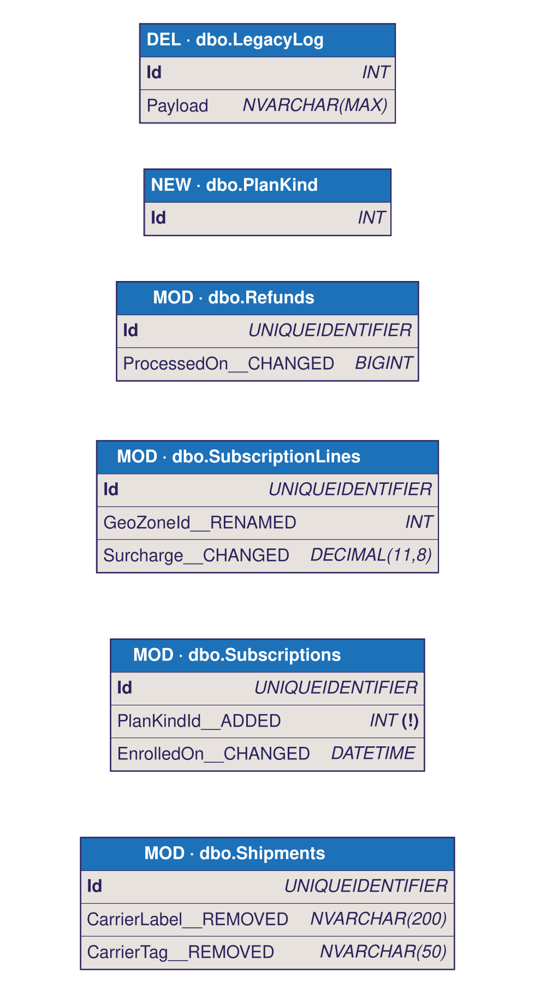

# dbml-diff

[](https://www.npmjs.com/package/dbml-diff)
[](https://github.com/afrugalpenguin/dbml-diff/actions/workflows/test.yml)
[](LICENSE)

Structurally diff two [DBML](https://dbml.dbdiagram.io/) schema files and emit the result as text, JSON, or an annotated DBML document that renders as a **visual diff in [dbdiagram.io](https://dbdiagram.io/)**.

No install needed:

```sh
npx dbml-diff old.dbml new.dbml                             # readable text summary
npx dbml-diff old.dbml new.dbml --format dbml -o diff.dbml  # visual diff, paste into dbdiagram.io
```

The visual diff shows *only what changed* - added, removed, and modified tables, with per-column annotations:



## Why

If you keep your database schema as DBML in version control, `git diff` between two versions is line-noise: attribute reordering, whitespace, and hundreds of unchanged lines drown the handful of real changes. dbdiagram.io has no built-in version compare, and existing schema-diff tools target live databases, not DBML files. `dbml-diff` compares the two documents *structurally* - tables, columns, types, nullability, primary keys, enums - and tells you exactly what changed. Related upstream issue: [holistics/dbml#175](https://github.com/holistics/dbml/issues/175).

## Install

```sh
npm i -g dbml-diff    # or keep using npx
```

## CLI usage

```
dbml-diff <old.dbml> <new.dbml> [options]

Options:
  --format <text|json|dbml>   output format (default: text)
  --full-new-tables           in dbml format, emit full column lists for
                              added tables (default: stub to PK + note with
                              column count, because full definitions drown
                              the diagram at scale)
  --colors                    in dbml format, use headercolor annotations
                              (#2ecc71 added / #f39c12 modified / #e74c3c
                              removed) instead of relying on name prefixes
                              alone. Requires dbdiagram paid tier to render;
                              name prefixes are always emitted regardless.
  -o, --output <file>         write to file instead of stdout
  -h, --help                  usage
  --version                   package version
```

The counts summary (`added: N, removed: N, modified: N`) always goes to **stderr**, so stdout stays pipeable.

## Visual diff conventions (`--format dbml`)

| Marker | Meaning |
| --- | --- |
| `NEW · ` table name prefix | Table added |
| `MOD · ` table name prefix | Table modified |
| `DEL · ` table name prefix | Table removed |
| `__ADDED` column suffix | Column added to a modified table |
| `__REMOVED` column suffix | Column removed from a modified table |
| `__RENAMED` column suffix | Rename candidate (heuristic - verify; never merged silently) |
| `__CHANGED` column suffix | Type or nullability changed (detail in the column `note`) |
| `NEW · ` / `MOD · ` / `DEL · ` enum name prefix | Enum added / modified / removed |
| `[note: 'ADDED']` / `[note: 'REMOVED']` on an enum value | Value added / removed in a modified enum |

Modified tables show only their primary key (annotated `unchanged columns omitted`) plus the changed columns. Added tables are stubbed to the PK with a `NEW TABLE - N columns` note by default (`--full-new-tables` emits everything); removed tables are emitted in full. Enum changes are emitted as `Enum` blocks under the same `NEW · / MOD · / DEL ·` prefixes; in a modified enum the full new value list is shown with `ADDED` notes on new values and the dropped values re-listed with `REMOVED` notes. A `Note diff_summary { ... }` block at the top lists the counts and the affected table names.

Relationship (`Ref:`) changes are reported in the `diff_summary` note (and in `--format text` / `--format json`): added and removed refs, plus `retargeted` when an FK side keeps its columns but points at a new parent. A change that cannot be mapped to a single retarget (an FK side gaining or losing several parents at once) is listed as `unresolved` rather than force-classified.

### Viewing the diff in dbdiagram.io

1. `dbml-diff old.dbml new.dbml --format dbml -o diff.dbml`
2. Open [dbdiagram.io](https://dbdiagram.io/d) and create a new diagram.
3. Paste the contents of `diff.dbml` into the editor.
4. The diagram now shows only what changed: scan for the `NEW ·` / `MOD ·` / `DEL ·` tables, and hover the annotated columns to read the change notes. With `--colors` (paid tier) the table headers are colour-coded too.

## Programmatic API

```js
const { diff, emitText, emitJson, emitDbml } = require('dbml-diff');

const result = diff(oldDbmlString, newDbmlString);
// {
//   tables: {
//     added:    [ { name, columns: [...] } ],
//     removed:  [ { name, columns: [...] } ],
//     modified: [ {
//       name,
//       columnsAdded: [...], columnsRemoved: [...],
//       columnsChanged: [ { column, changes: ['type X -> Y', ...] } ],
//       renames: [ { from, to } ]   // heuristic candidates only
//     } ]
//   },
//   enums: {
//     added:    [ { name, values: [...] } ],
//     removed:  [ { name, values: [...] } ],
//     modified: [ { name, values: [...], valuesAdded: [...], valuesRemoved: [...] } ]
//   },
//   refs: {
//     added:      [ { from: { table, columns }, to: { table, columns } } ],
//     removed:    [ { from, to } ],
//     retargeted: [ { from, oldTo, newTo } ],   // same FK side, new parent
//     unresolved: [ { from, oldTargets: [...], newTargets: [...] } ]  // ambiguous
//   },
//   counts: { added, removed, modified }   // tables only
// }

console.log(emitText(result));
console.log(emitJson(result));
console.log(emitDbml(result, { oldLabel: 'v1', newLabel: 'v2', colors: true }));
```

## Exit codes

Useful for CI gates ("fail the build if the schema changed"):

| Exit code | Meaning |
| --- | --- |
| `0` | Schemas are identical |
| `1` | Differences found |
| `2` | Error (bad arguments, unreadable file, DBML parse failure) |

## Parsing behaviour

- dbdiagram-specific `DiagramView` and `TableGroup` top-level blocks are stripped before parsing (`@dbml/core` rejects `DiagramView`).
- Primary keys are detected from inline `[pk]` attributes **and** from `Indexes { Col [pk] }` blocks.
- Schema-qualified table names (e.g. `dbo.Shipments`) are preserved as-is.

## Roadmap

**[Visual public roadmap](https://afrugalpenguin.github.io/dbml-diff/roadmap.html)** - what shipped, what's in progress, what's next. Generated from the issue tracker: issues labelled `roadmap` become cards, `status:` labels set the column, closed issues land in Launched.

- Table group diffing
- `--format sql` - ALTER statement generation (see upstream [holistics/dbml#175](https://github.com/holistics/dbml/issues/175))

## License

Apache-2.0.
